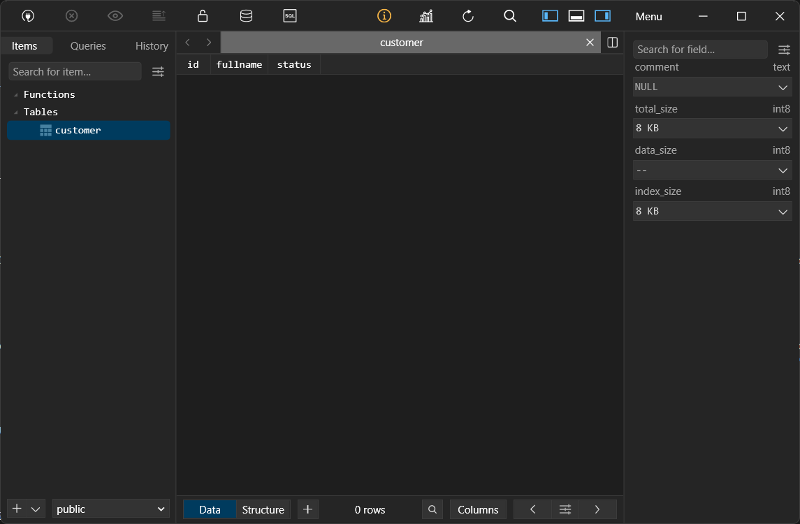

# Persistencia de datos con PostgreSQL y Docker

## 1. Título
Persistencia de datos en bases de datos PostgreSQL usando contenedores Docker con y sin volúmenes

## 2. Tiempo de duración
40 minutos

## 3. Fundamentos

Se exploran los principios esenciales del uso de contenedores en Docker, con un enfoque particular en la gestión del almacenamiento de datos mediante el uso de volúmenes persistentes. Uno de los aspectos clave al trabajar con contenedores, especialmente cuando se implementan bases de datos como PostgreSQL, es comprender la diferencia entre almacenamiento efímero (temporal) y almacenamiento persistente (duradero).

Por defecto, los contenedores en Docker están diseñados para ser efímeros: cualquier dato almacenado dentro del sistema de archivos del contenedor se elimina automáticamente cuando el contenedor se detiene y es eliminado. Esto representa una limitación importante en escenarios donde se necesita conservar información entre sesiones o reinicios del sistema.

Para resolver este problema, Docker introduce el concepto de volúmenes, que son directorios especiales gestionados por Docker y ubicados fuera del sistema de archivos del contenedor. Estos volúmenes permiten que los datos persistan más allá del ciclo de vida del contenedor. En otras palabras, aunque un contenedor sea detenido, eliminado o incluso recreado, los datos almacenados en el volumen no se pierden y pueden ser reutilizados por un nuevo contenedor que monte ese mismo volumen.


## 4. Conocimientos previos

Para realizar esta práctica se debe tener conocimiento en:

- Uso de terminal o consola de comandos
- Comandos básicos de Linux
- Manejo de Docker: crear, detener y eliminar contenedores
- Conexión a bases de datos con herramientas como DataGrip o TablePlus

## 5. Objetivos a alcanzar

- Crear contenedores de PostgreSQL
- Implementar almacenamiento persistente con volúmenes.
- Validar la persistencia de datos en PostgreSQL tras eliminar un contenedor.

## 6. Equipo necesario

- Computador con Sistema Operativo
- Terminal de comandos
- Conexión a Internet
- Docker
- Cliente de base de datos (DataGrip o TablePlus)

## 7. Material de apoyo

- Documentación oficial de Docker
- Guía de la asignatura (Volumenes)
- Guía de comandos de volúmenes en docker

## 8. Procedimiento

- ### Parte 1: Base de datos sin volumen

### Paso 1: Crear un contenedor PostgreSQL con el nombre server_db1.

```bash
docker run --name server_db1 -e POSTGRES_PASSWORD=1234 -p 5432:5432 -d postgres
```


### Paso 2: Conectar un administrador de base de datos (como DataGrip o TablePlus) al contenedor server_db1.


### Paso 3: Crear una base de datos llamada test.


### Paso 4: En la base de datos test, crear una tabla llamada customer con los campos: id, fullname y status.


### Paso 5: Insertar al menos un registro en la tabla customer.


### Paso 6: Detener y eliminar el contenedor server_db1.

```bash
docker stop server_db1
docker rm server_db1
```


### Paso 7: Volver a crear el contenedor PostgreSQL con el mismo nombre server_db1.

```bash
docker run --name server_db1 -e POSTGRES_PASSWORD=1234 -p 5432:5432 -d postgres
```


### Paso 8: Conectarse nuevamente desde el administrador de base de datos.


### Paso 9: Verificar que la base de datos test ya no existe, demostrando que los datos no se han conservado.


- ### Parte 2: Base de datos con volumen

### Paso 1: Crear un volumen en Docker con el comando:

```bash
docker volume create pgdata
```


### Paso 2: Crear un contenedor PostgreSQL con el nombre server_db2, asociando el volumen creado:

```bash
docker run --name server_db2 -e POSTGRES_PASSWORD=1234 -p 5433:5432 -v pgdata:/var/lib/postgresql/data -d postgres
```


### Paso 3: Conectarse al contenedor con DataGrip o TablePlus.


### Paso 4: Crear la base de datos test.


### Paso 5: Crear la tabla customer con los campos: id, fullname, status.



### Paso 6: Insertar al menos un registro en la tabla.


### Paso 7: Detener y eliminar el contenedor server_db2.

```bash
docker stop server_db2
docker rm server_db2
```


### Paso 8: Volver a crear el contenedor server_db2 usando el volumen pgdata nuevamente.

```bash
docker run --name server_db2 -e POSTGRES_PASSWORD=1234 -p 5433:5432 -v pgdata:/var/lib/postgresql/data -d postgres
```


### Paso 9: Conectarse desde el administrador de base de datos y verificar que la base de datos test y los registros han persistido.


## 9. Resultados esperados

- Si se utilizan contenedores sin volumen, se pierden al eliminar el contenedor.

- Si se utilizan contenedores con volumen, los datos persisten incluso tras detener y eliminar el contenedor.


##10. Bibliografía

