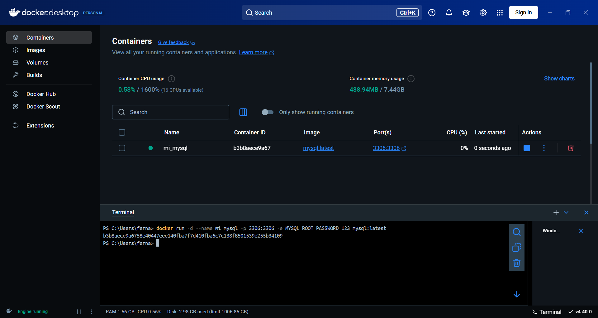
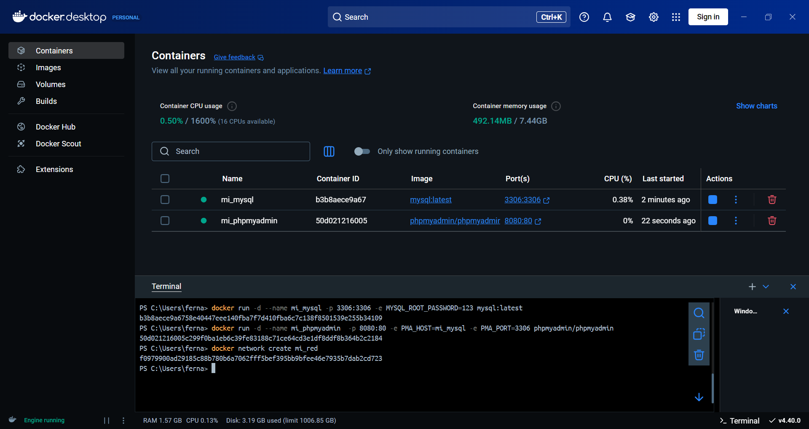
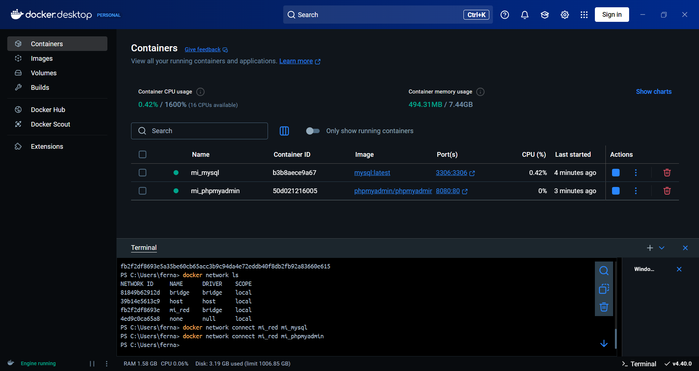
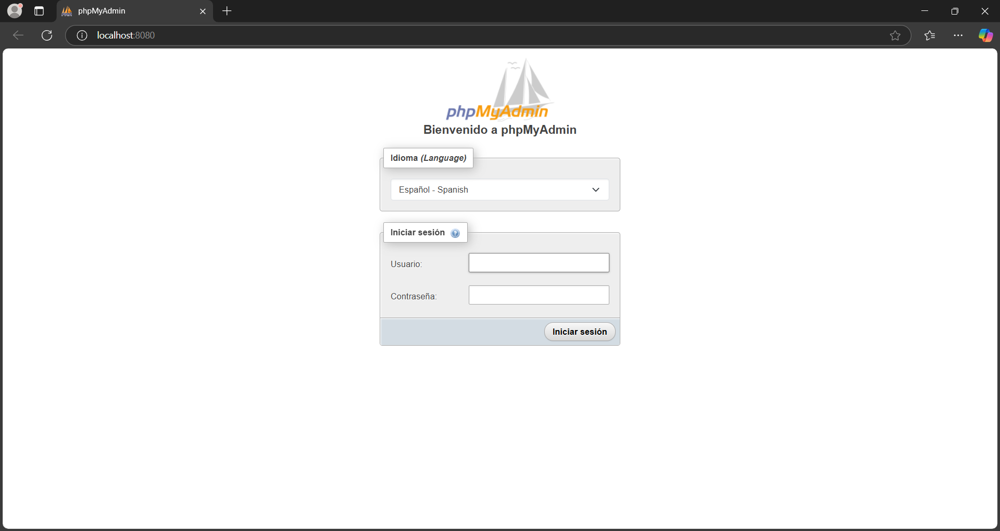
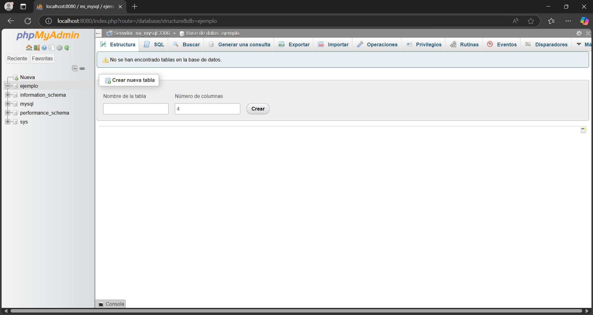

# Implementación de contenedores Docker para MySQL y phpMyAdmin en una red personalizada

## 1. **Título**
**Implementación de contenedores Docker para MySQL y phpMyAdmin en una red personalizada**


## 2. **Tiempo de duración**

45 minutos  


## 3. **Fundamentos**

Docker es una plataforma de contenedores que permite a los desarrolladores empaquetar aplicaciones y sus dependencias en unidades estandarizadas llamadas "contenedores". Estos contenedores pueden ejecutarse de manera consistente en cualquier entorno, ya sea en desarrollo, pruebas o producción.

En esta práctica, se utilizan dos contenedores principales:

- **MySQL**: Es un sistema de gestión de bases de datos relacional (RDBMS). Docker facilita su despliegue sin necesidad de instalación manual, ya que la imagen oficial de MySQL contiene todo lo necesario para ejecutar el servicio de bases de datos.
  
- **phpMyAdmin**: Es una herramienta web escrita en PHP que permite gestionar bases de datos MySQL a través de una interfaz gráfica. Con phpMyAdmin, podemos realizar tareas de administración de bases de datos sin tener que utilizar la línea de comandos.


### Conceptos clave:
- **Contenedor Docker**: Un contenedor es una instancia de una imagen de Docker que puede ejecutarse de manera aislada, permitiendo que diferentes aplicaciones o servicios se ejecuten sin interferencias.
- **Red Docker**: Las redes en Docker permiten que los contenedores se comuniquen entre sí sin exponer sus puertos al exterior.
- **Variables de entorno**: Docker permite configurar contenedores utilizando variables de entorno, como `MYSQL_ROOT_PASSWORD` para establecer contraseñas en servicios como MySQL.


## 4. **Conocimientos previos**

Para realizar esta práctica, se debe tener conocimientos sobre los siguientes temas:

- Comandos Docker
- Uso básico de MySQL
- phpMyAdmin
- Sistemas operativos
- Creación y administración de redes en Docker


## 5. **Objetivos a alcanzar**

- Implementar contenedores Docker para **MySQL** y **phpMyAdmin**.
- Configurar una **red Docker personalizada** para permitir la comunicación entre los contenedores.
- **Gestionar bases de datos MySQL** a través de la interfaz web de phpMyAdmin.
- **Crear una base de datos**


## 6. **Equipo necesario**

- **Computadora con sistema operativo**: Windows, Linux o macOS.
- **Docker instalado**
  

## 7. **Material de apoyo**

- **Documentación oficial de Docker**
- **Guía de asignatura**
- **Documentación de phpMyAdmin**


## 8. **Procedimiento**

A continuación, se detallan los pasos necesarios para completar la práctica:

### Paso 1: Crear el contenedor de MySQL

Ejecute el siguiente comando para crear un contenedor de MySQL:

```bash
docker run -d --name mi_mysql -p 3306:3306 -e MYSQL_ROOT_PASSWORD=123 mysql:latest
```


### Paso 2: Crear el contenedor de phpMyAdmin

Ejecute el siguiente comando para crear el contenedor de phpMyAdmin:

```bash
docker run -d --name mi_phpmyadmin -p 8080:80 -e PMA_HOST=mi_mysql -e PMA_PORT=3306 phpmyadmin/phpmyadmin
```


### Paso 3: Crear una red personalizada

Cree una red personalizada para permitir que los contenedores se comuniquen entre sí:

```bash
docker network create --attachable mi_red
```


### Paso 4: Conectar los contenedores a la red

Conecte ambos contenedores a la red recién creada:

```bash
docker network connect mi_red mi_mysql
docker network connect mi_red mi_phpmyadmin
```


### Paso 5: Acceder a phpMyAdmin

Acceda a la interfaz de phpMyAdmin desde su navegador en http://localhost:8080. Inicie sesión con las siguientes credenciales:
- Usuario: root
- Contraseña: 123



### Paso 6: Crear una base de datos de prueba
En phpMyAdmin, vaya a la pestaña "Bases de datos" y cree una nueva base de datos llamada ejemplo.



## 9. **Resultados esperados**

Al final de la práctica, se podra acceder a phpMyAdmin en el navegador, conectarte a MySQL y crear una base de datos de prueba. La estructura final será la siguiente:

- Un contenedor mi_mysql que ejecuta MySQL.

- Un contenedor mi_phpmyadmin que proporciona una interfaz web para gestionar MySQL.

- Ambos contenedores deben estar conectados en una red Docker llamada mi_red.


## 10. **Bibliografía**

- Cómo crear una red de puente personalizada de Docker. (s/f). LabEx. Recuperado el 27 de abril de 2025, de https://labex.io/es/tutorials/docker-how-to-create-a-custom-docker-bridge-network-411523

- Docker Documentation. (2025). Docker Inc. https://docs.docker.com

- (Práctica 7. Creación de un contenedor Docker con phpMyAdmin). Josejuansanchez.org. Recuperado el 27 de abril de 2025, de https://josejuansanchez.org/bd/practica-07/index.html

- Como crear un contenedor con Docker-Mysql y persistir la información. (s/f). Platzi. Recuperado el 27 de abril de 2025, de https://platzi.com/tutoriales/1432-docker-2018/3268-como-crear-un-contenedor-con-docker-mysql-y-persistir-la-informacion/
