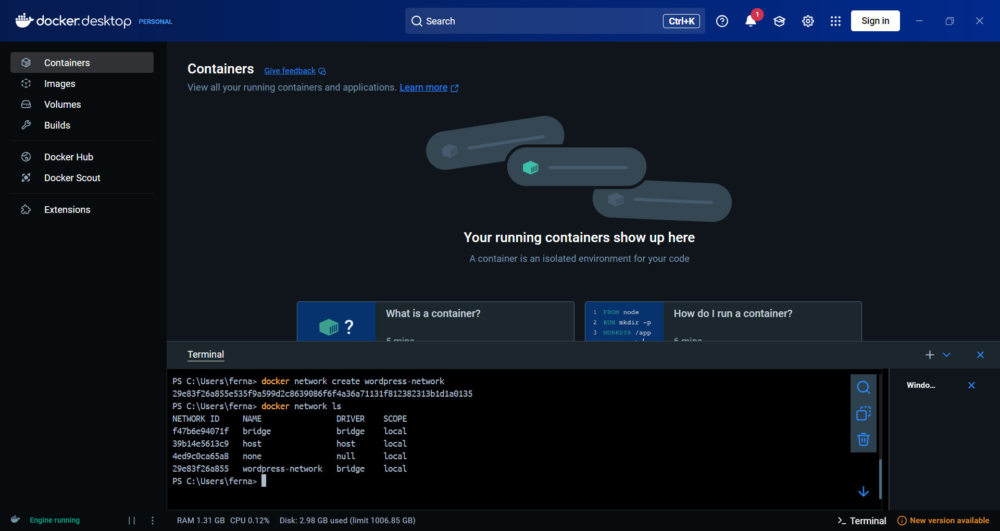
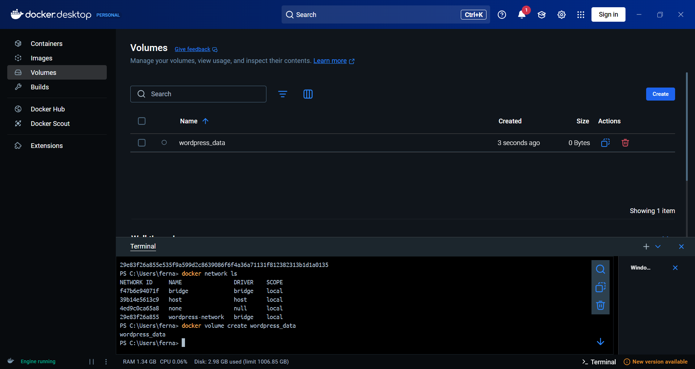
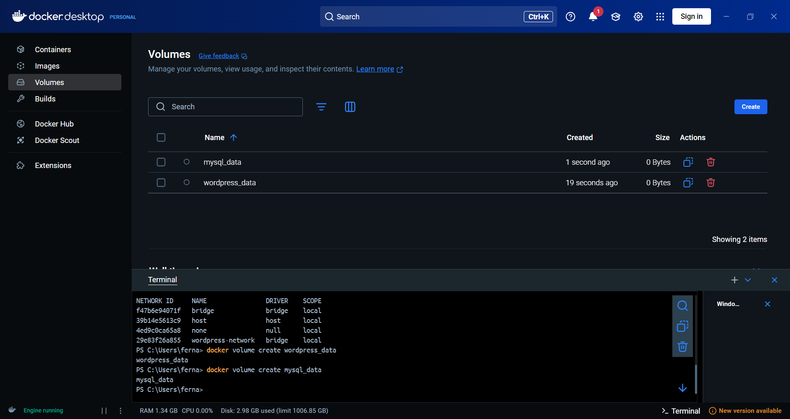
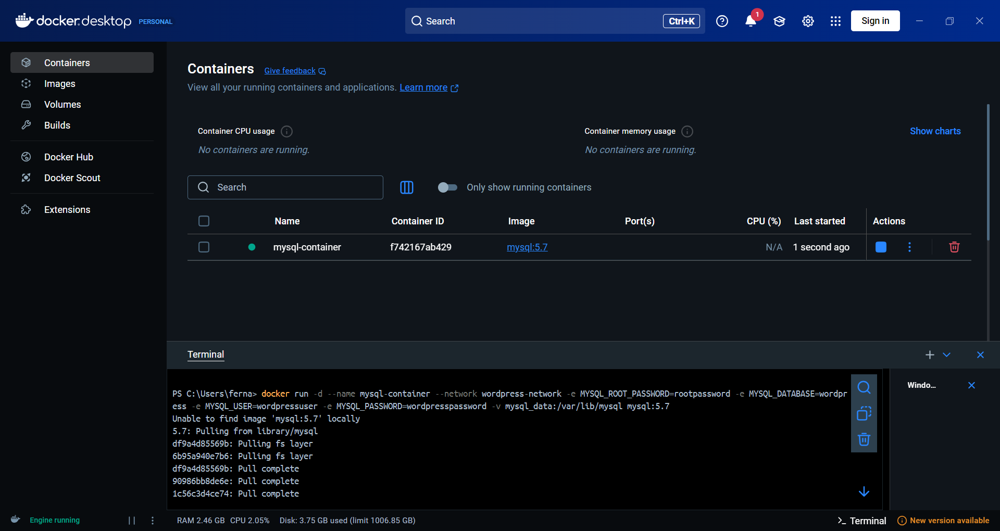
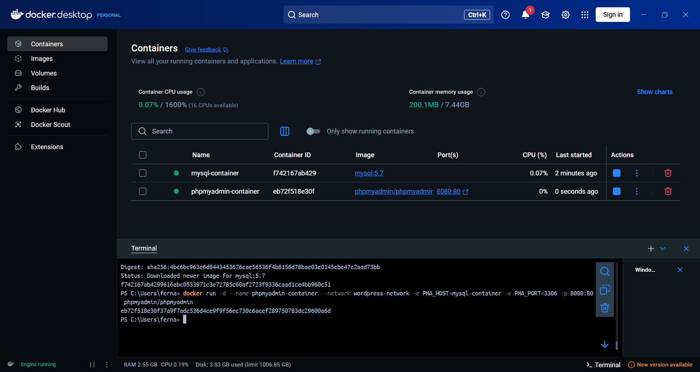
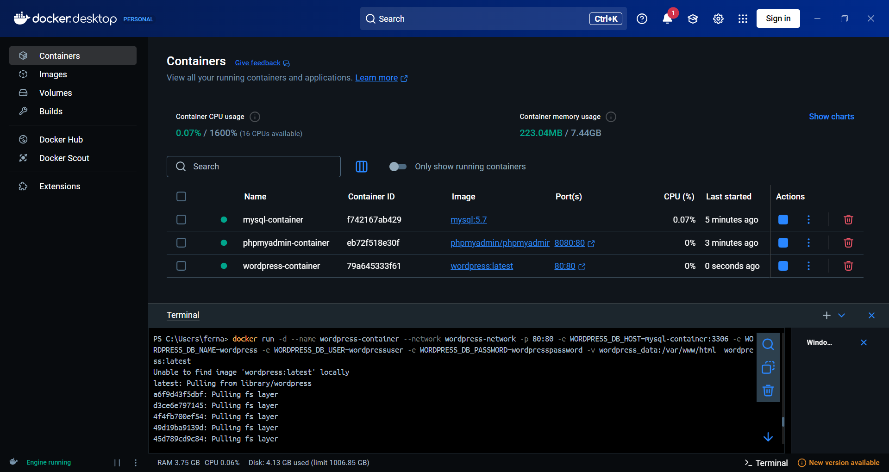
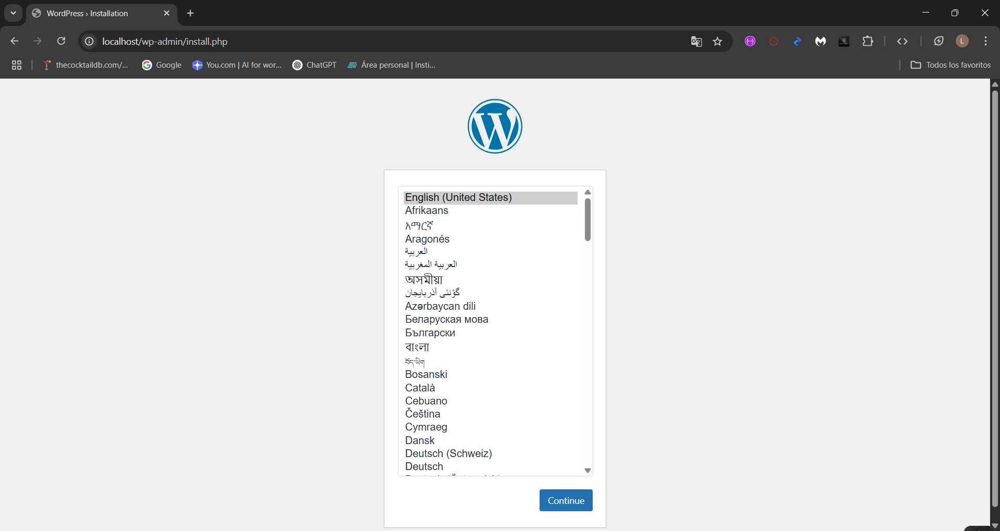
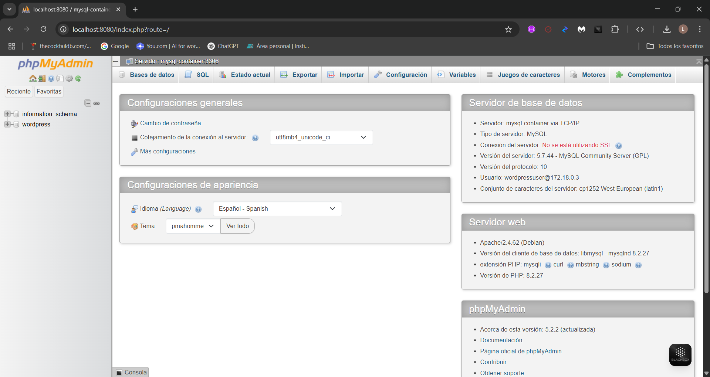

# Despliegue de un Sitio WordPress con Docker: Contenedores para WordPress, MySQL y phpMyAdmin

## 1. Título

**Despliegue de un Sitio WordPress con Docker: Contenedores para WordPress, MySQL y phpMyAdmin**

## 2. Tiempo de duración

**45 minutos**

## 3. Fundamentos

Se utiliza Docker para crear un entorno aislado y flexible para ejecutar un sitio web basado en WordPress, con MySQL y phpMyAdmin, sin necesidad de instalar software directamente en el sistema operativo. Docker es una plataforma de software que permite automatizar la implementación de aplicaciones dentro de contenedores. Un contenedor es una unidad estándar de software que empaqueta el código y todas sus dependencias, lo que permite ejecutar aplicaciones de manera rápida y confiable en cualquier entorno.

Docker usa imágenes, que son plantillas inmutables de sistemas de archivos, para crear contenedores. En este caso, se utilizaron imágenes oficiales de MySQL y WordPress, junto con la imagen de phpMyAdmin para gestionar la base de datos de MySQL.

Un concepto clave es la creación de redes y volúmenes. Docker permite crear redes virtuales que conectan contenedores, facilitando la comunicación entre ellos. En esta práctica, se creó una red `wordpress-network` para que los contenedores de WordPress, MySQL y phpMyAdmin pudieran interactuar entre sí. Además, se utilizaron volúmenes para almacenar de manera persistente los datos de la base de datos MySQL y los archivos de WordPress, lo que garantiza que la información no se pierda cuando los contenedores se detengan o eliminen.

Docker también simplifica la administración de contenedores, permitiendo iniciar, detener y gestionar contenedores de manera eficiente utilizando comandos simples, como `docker run`, `docker volume create` y `docker network create`. Este enfoque facilita el desarrollo, despliegue y mantenimiento de aplicaciones sin tener que preocuparse por las dependencias del sistema operativo subyacente.


### Imagen 1-1: Diagrama de contenedores en Docker

## 4. Conocimientos previos

Para realizar esta práctica, se necesita tener claros los siguientes temas:

- **Docker**: Conocimiento básico sobre la creación y gestión de contenedores con Docker.
- **Comandos de Docker**: Uso de comandos como `docker run`, `docker network create`, `docker volume create`, entre otros.
- **Redes y Volúmenes en Docker**: Comprender la importancia de las redes para la comunicación entre contenedores y el uso de volúmenes para persistencia de datos.

## 5. Objetivos a alcanzar

- Crear y configurar contenedores Docker para WordPress, MySQL y phpMyAdmin.
- Implementar una red Docker para permitir la comunicación entre los contenedores.
- Usar volúmenes Docker para asegurar la persistencia de datos.
- Acceder a WordPress a través de un navegador y administrar la base de datos mediante phpMyAdmin.

## 6. Equipo necesario

- Computadora con sistema operativo **Windows/Linux/Mac**.
- **Docker Desktop** instalado en el equipo.
- Conexión a internet para descargar las imágenes necesarias de Docker.

## 7. Material de apoyo

- **Documentación oficial de Docker**: [https://docs.docker.com/](https://docs.docker.com/)
- **Guía de asignatura**: Documento proporcionado por el docente con detalles adicionales de la práctica.
- **Cheat sheet de Linux**: Guía rápida de comandos de Linux que puede ser útil durante el proceso de ejecución de Docker.

## 8. Procedimiento

### Paso 1: Crear una red Docker para los contenedores

Se comienza creando una red personalizada para que los contenedores puedan comunicarse entre sí:

```bash
docker network create wordpress-network
```


### Paso 2: Crear volúmenes Docker para los datos de MySQL y WordPress

Luego, se crean dos volúmenes para almacenar de manera persistente los datos de MySQL y los archivos de WordPress:

```bash
docker volume create mysql_data
docker volume create wordpress_data
```




### Paso 3: Crear el contenedor de MySQL

A continuación, se crea el contenedor para MySQL, configurando las variables de entorno necesarias:

```bash
docker run -d --name mysql-container --network wordpress-network -e MYSQL_ROOT_PASSWORD=rootpassword -e MYSQL_DATABASE=wordpress -e MYSQL_USER=wordpressuser -e MYSQL_PASSWORD=wordpresspassword -v mysql_data:/var/lib/mysql mysql:5.7
```


### Paso 4: Crear el contenedor de phpMyAdmin

Se crea el contenedor para phpMyAdmin para poder gestionar la base de datos MySQL de manera visual:

```bash
docker run -d --name phpmyadmin-container --network wordpress-network -e PMA_HOST=mysql-container -e PMA_PORT=3306 -p 8080:80 phpmyadmin/phpmyadmin
```


### Paso 5: Crear el contenedor de WordPress

Por último, se lanza el contenedor de WordPress, conectándolo a la base de datos MySQL y configurando los volúmenes necesarios:

```bash
docker run -d --name wordpress-container --network wordpress-network -p 80:80 -e WORDPRESS_DB_HOST=mysql-container:3306 -e WORDPRESS_DB_NAME=wordpress -e WORDPRESS_DB_USER=wordpressuser -e WORDPRESS_DB_PASSWORD=wordpresspassword -v wordpress_data:/var/www/html wordpress:latest
```


## 9. Resultados esperados

Al finalizar la práctica, se espera obtener los siguientes resultados:

- Acceso a WordPress: Se puede acceder a la interfaz de WordPress a través de http://localhost en un navegador.



- Acceso a phpMyAdmin: Se puede acceder a phpMyAdmin mediante http://localhost:8080 para gestionar la base de datos MySQL.



- Persistencia de datos: Los datos de WordPress y MySQL se mantienen incluso si se detienen o eliminan los contenedores, gracias a los volúmenes.

## 10. Bibliografía

- Docker, Inc. (2023). Docker Documentation. Recuperado de https://docs.docker.com/
- Gómez, S. (s/f). Levantar un WordPress con Docker - Taller de Docker. Github.io. Recuperado el 6 de mayo de 2025, de https://aulasoftwarelibre.github.io/taller-de-docker/wordpress/
- dockerHub (phpmyadmin). Docker.com. Recuperado el 3 de mayo de 2025, de https://hub.docker.com/_/phpmyadmin
- dockerHub (wordpress). Docker.com. Recuperado el 3 de mayo de 2025, de https://hub.docker.com/_/wordpress
- dockerHub (mysql). Docker.com. Recuperado el 3 de mayo de 2025, de https://hub.docker.com/_/mysql
