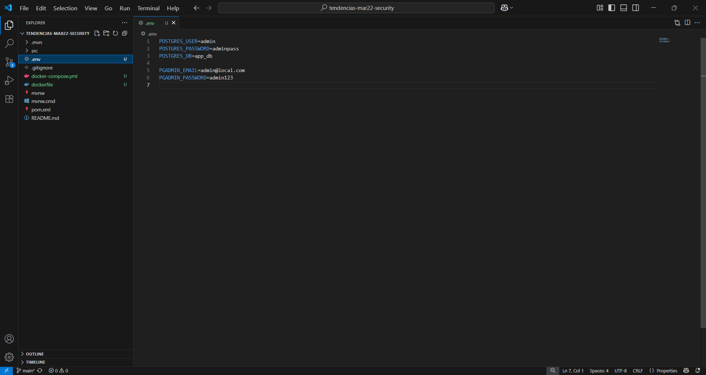

# Despliegue de aplicación Backend con PostgreSQL y pgAdmin Usando Docker Compose

## 1. Título

**Despliegue de aplicación Backend con PostgreSQL y pgAdmin Usando Docker Compose**

## 2. Tiempo de duración

**45 minutos**

## 3. Fundamentos

Se utiliza **Docker** y **Docker Compose** para desplegar una aplicación backend Java (Spring Boot) conectada a una base de datos PostgreSQL, con acceso a través de **pgAdmin** como herramienta de administración gráfica.

Este entorno se define mediante un archivo `docker-compose.yml`, lo cual permite levantar todos los servicios con un solo comando. Se incluyen:

* Contenedor para la aplicación backend (Java + Spring Boot),
* Contenedor para PostgreSQL como sistema gestor de base de datos relacional,
* Contenedor para pgAdmin para gestionar PostgreSQL visualmente.

Se configuran también:

* Una **red personalizada** (`backend_network`) para conectar los servicios,
* **Volúmenes persistentes** (`postgres_data`, `pgadmin_data`) para mantener los datos entre reinicios.

Este enfoque facilita el despliegue local para desarrollo, pruebas y educación de forma aislada del sistema anfitrión.


## 4. Conocimientos previos

* **Docker**: Contenedores, volúmenes, redes, imágenes.
* **Docker Compose**: Sintaxis de YAML, comandos básicos (`up`, `down`, `build`).
* **PostgreSQL y pgAdmin**: Conexión, gestión de bases de datos.
* **Java (Spring Boot)**: Conocimiento básico de proyectos Maven.

## 5. Objetivos a alcanzar

* Crear un entorno con PostgreSQL y pgAdmin usando `docker-compose`.
* Construir la imagen del backend Java usando un `Dockerfile`.
* Configurar la conexión del backend a PostgreSQL.
* Usar redes y volúmenes para persistencia y conectividad.
* Acceder a pgAdmin para verificar la base de datos.
* Usar técnicas de **multi-stage builds** para optimizar la imagen del backend.

## 6. Equipo necesario

* PC con Windows, Linux o macOS.
* Docker y Docker Compose instalados.
* Acceso a internet para descargar imágenes.
* Git para clonar el repositorio base.

## 7. Material de apoyo

* [Documentación oficial de Docker](https://docs.docker.com/)
* [Documentación de Spring Boot](https://spring.io/projects/spring-boot)
* [Guía oficial de PostgreSQL](https://www.postgresql.org/docs/)
* [pgAdmin Docs](https://www.pgadmin.org/docs/)

## 8. Procedimiento

### Paso 1: Crear el `docker-compose.yml`

```yaml
version: "3.8"

services:
  db:
    image: postgres:15
    container_name: postgres_db
    restart: always
    environment:
      POSTGRES_USER: ${POSTGRES_USER}
      POSTGRES_PASSWORD: ${POSTGRES_PASSWORD}
      POSTGRES_DB: ${POSTGRES_DB}
    volumes:
      - postgres_data:/var/lib/postgresql/data
    networks:
      - backend_network

  pgadmin:
    image: dpage/pgadmin4
    container_name: pgadmin
    restart: always
    environment:
      PGADMIN_DEFAULT_EMAIL: ${PGADMIN_EMAIL}
      PGADMIN_DEFAULT_PASSWORD: ${PGADMIN_PASSWORD}
    ports:
      - "5050:80"
    volumes:
      - pgadmin_data:/var/lib/pgadmin
    networks:
      - backend_network
    depends_on:
      - db

  backend:
    build:
      context: ./backend
      dockerfile: Dockerfile
    container_name: backend_app
    ports:
      - "8080:8080"
    environment:
      SPRING_DATASOURCE_URL: jdbc:postgresql://db:5432/${POSTGRES_DB}
      SPRING_DATASOURCE_USERNAME: ${POSTGRES_USER}
      SPRING_DATASOURCE_PASSWORD: ${POSTGRES_PASSWORD}
    networks:
      - backend_network
    depends_on:
      - db

volumes:
  postgres_data:
  pgadmin_data:

networks:
  backend_network:
    driver: bridge
```


### Paso 2: Crear el archivo `.env`

```dotenv
POSTGRES_USER=admin
POSTGRES_PASSWORD=adminpass
POSTGRES_DB=app_db

PGADMIN_EMAIL=admin@local.com
PGADMIN_PASSWORD=admin123
```


### Paso 3: Crear el `Dockerfile` con multi-stage build

Ubicado en `backend/Dockerfile`:

```Dockerfile
# Etapa 1: Compilar
FROM maven:3.9.6-eclipse-temurin-17 AS builder
WORKDIR /app
COPY pom.xml .
COPY src ./src
RUN mvn clean package -DskipTests

# Etapa 2: Imagen final
FROM eclipse-temurin:17-jdk-alpine
WORKDIR /app
COPY --from=builder /app/target/*.jar app.jar
EXPOSE 8080
ENTRYPOINT ["java", "-jar", "app.jar"]
```


### Paso 4: Levantar los servicios

```bash
docker-compose up --build -d
```


## 9. Resultados esperados

* Aplicación backend ejecutándose en el puerto `8080`.
* pgAdmin disponible en el puerto `5050`.
* Conexión establecida entre backend y PostgreSQL.
* pgAdmin permite gestionar la base de datos gráficamente.
* Persistencia de datos tras reinicios gracias a volúmenes.
* Imagen del backend optimizada con multi-stage builds.

## 10. Bibliografía

* Docker, Inc. (2024). [Docker Documentation](https://docs.docker.com/)
* PostgreSQL Global Development Group. [PostgreSQL Docs](https://www.postgresql.org/docs/)
* pgAdmin Team. [pgAdmin Docs](https://www.pgadmin.org/docs/)
* DockerHub (PostgreSQL): [https://hub.docker.com/\_/postgres](https://hub.docker.com/_/postgres)
* DockerHub (pgAdmin): [https://hub.docker.com/r/dpage/pgadmin4](https://hub.docker.com/r/dpage/pgadmin4)
