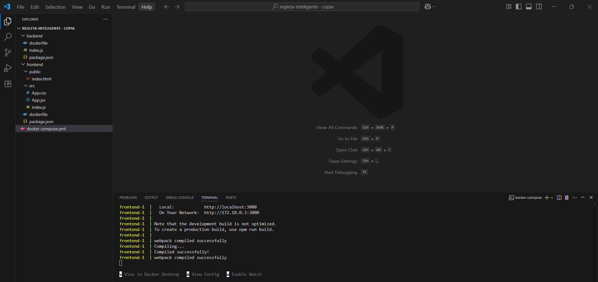
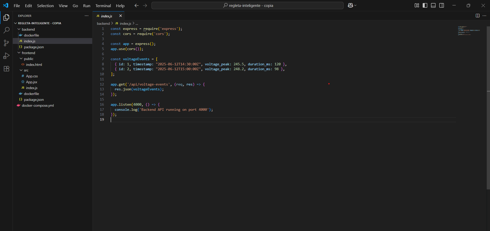
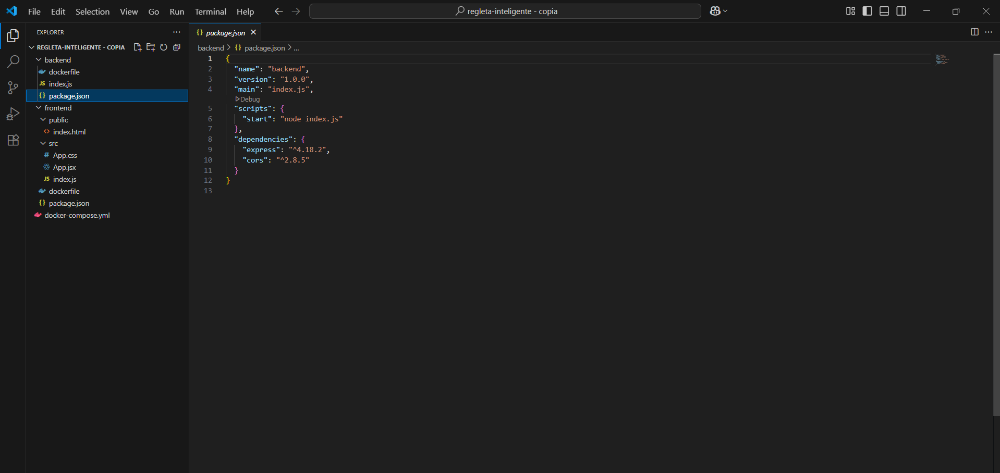
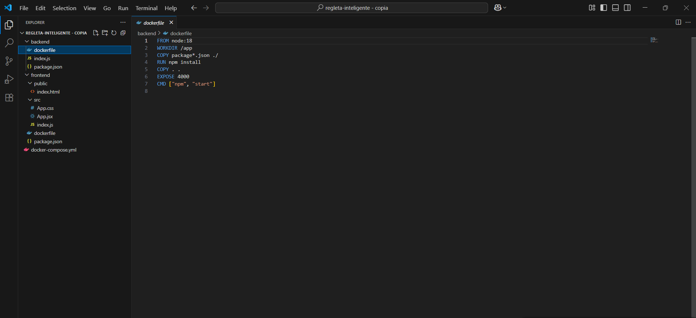
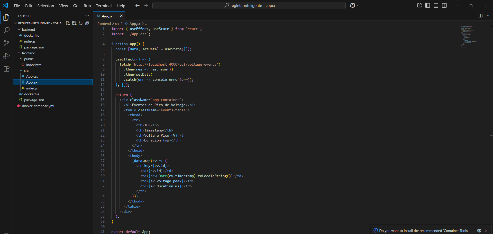
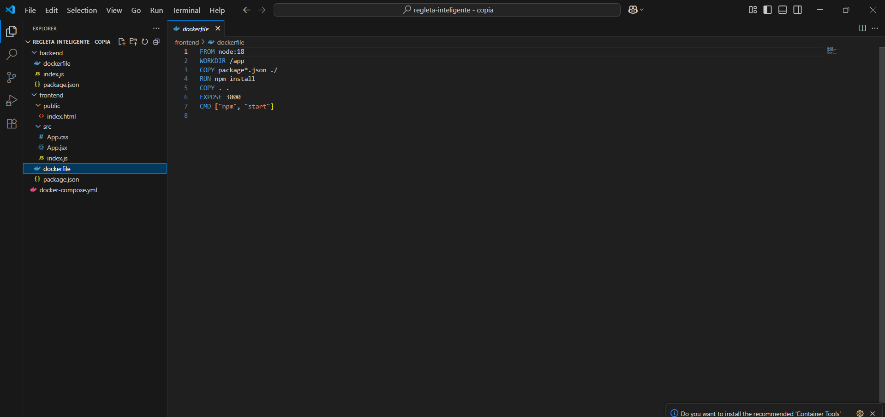
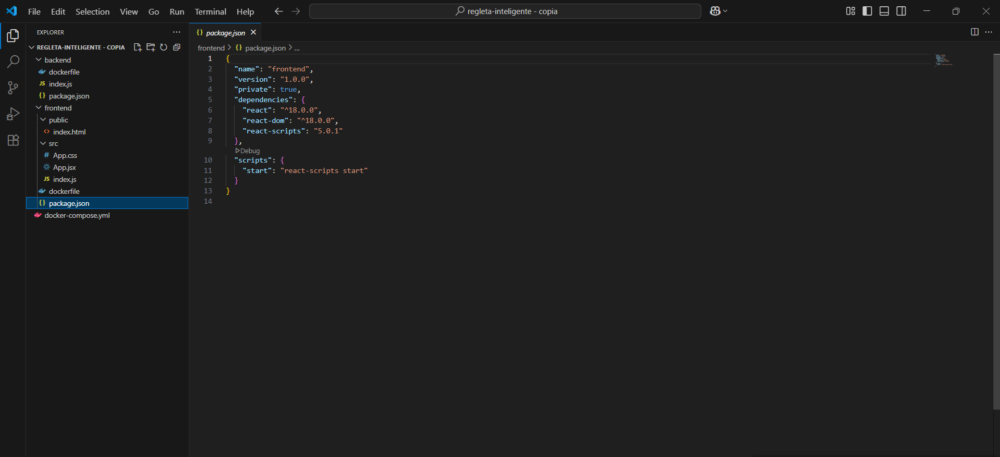
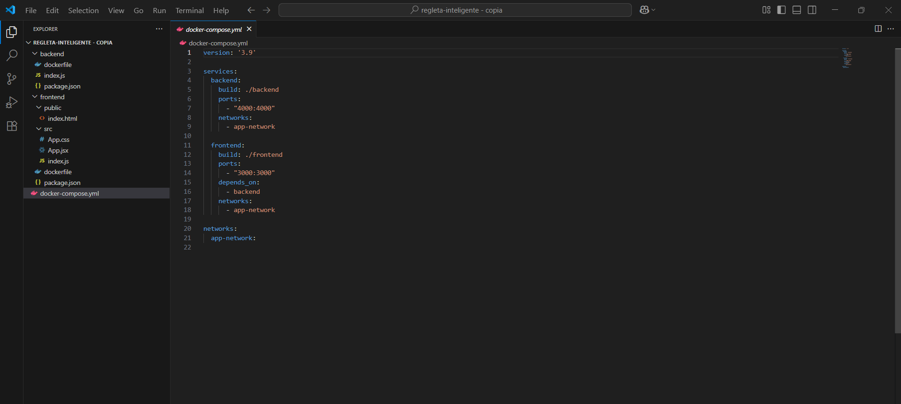
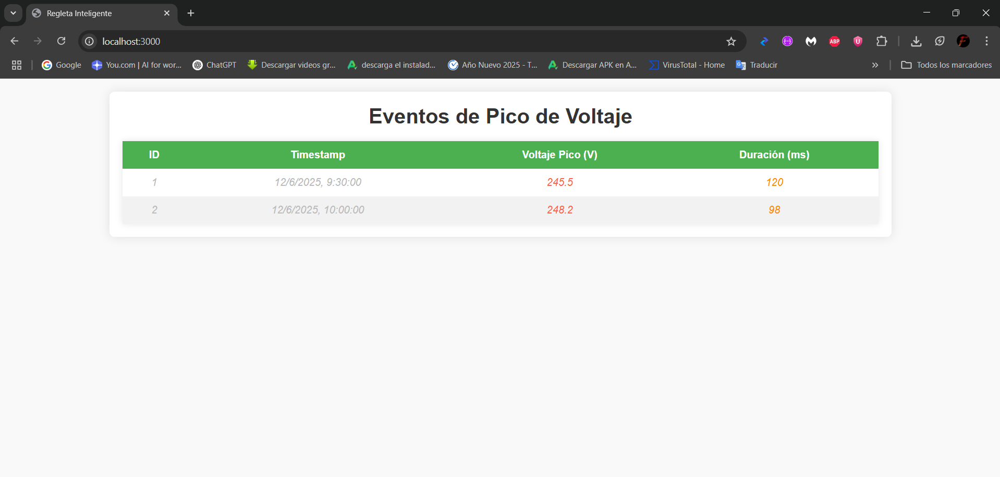

# **Contenerización de una Aplicación React con Backend API REST usando Docker**

## 1. Título

**Contenerización de una Aplicación React con Backend API REST usando Docker**

## 2. Tiempo de duración

**45 minutos**

## 3. Fundamentos

Esta práctica tiene como objetivo contenerizar una aplicación React junto con un backend Express que expone una API REST. Ambas aplicaciones se ejecutarán en contenedores Docker y se comunicarán entre sí utilizando Docker Compose. La aplicación React mostrará una tabla con datos provenientes de una API que proporciona información sobre una entidad relacionada con el proyecto de la "regleta inteligente".

El propósito es entender cómo contenerizar aplicaciones, establecer la comunicación entre contenedores y manejar datos dinámicos en la interfaz de usuario.

## 4. Conocimientos previos

* **Docker**: Familiaridad con contenedores, imágenes y Docker Compose.
* **React**: Conocimiento básico de cómo funciona una aplicación frontend con React.
* **Node.js y Express**: Experiencia con la creación de APIs REST.
* **CORS**: Comprensión del manejo de solicitudes entre dominios.

## 5. Objetivos a alcanzar

1. Contenerizar dos aplicaciones (React y Express) usando Docker.
2. Establecer comunicación entre contenedores usando Docker Compose.
3. Crear una interfaz en React que consuma datos desde un backend Express.
4. Mostrar una tabla con datos dinámicos obtenidos desde la API.

## 6. Equipo necesario

* Computadora con Windows, Linux o macOS.
* Docker instalado.
* Acceso a Internet para clonar repositorios y descargar dependencias.

## 7. Material de apoyo

* [Documentación oficial de Docker](https://docs.docker.com/)
* [Documentación de React](https://react.dev/)
* [Documentación de Express](https://expressjs.com/)

## 8. Procedimiento

### Paso 1: Estructura de Proyecto

```bash
/regleta-inteligente/
│
├── backend/
│   ├── index.js
│   ├── package.json
│   ├── Dockerfile
│
├── frontend/
│   ├── src/
│   │   └── App.jsx
│   ├── public/
│   ├── Dockerfile
│   ├── package.json
│
├── docker-compose.yml
```


### Paso 2: Backend (Express + CORS)

1. **backend/index.js**

```javascript
const express = require('express');
const cors = require('cors');

const app = express();
app.use(cors());

const voltageEvents = [
  { id: 1, timestamp: "2025-06-12T14:30:00Z", voltage_peak: 245.5, duration_ms: 120 },
  { id: 2, timestamp: "2025-06-12T15:00:00Z", voltage_peak: 248.2, duration_ms: 98 },
];

app.get('/api/voltage-events', (req, res) => {
  res.json(voltageEvents);
});

app.listen(4000, () => {
  console.log('Backend API running on port 4000');
});
```


2. **backend/package.json**

```json
{
  "name": "backend",
  "version": "1.0.0",
  "main": "index.js",
  "scripts": {
    "start": "node index.js"
  },
  "dependencies": {
    "express": "^4.18.2",
    "cors": "^2.8.5"
  }
}
```


3. **backend/Dockerfile**

```Dockerfile
FROM node:18
WORKDIR /app
COPY package*.json ./
RUN npm install
COPY . .
EXPOSE 4000
CMD ["npm", "start"]
```


### Paso 3: Frontend (React)

1. **frontend/src/App.jsx**

```jsx
import { useEffect, useState } from 'react';
import './App.css';

function App() {
  const [data, setData] = useState([]);

  useEffect(() => {
    fetch('http://backend:4000/api/voltage-events')
      .then(res => res.json())
      .then(setData)
      .catch(err => console.error(err));
  }, []);

  return (
    <div className="App">
      <h1>Eventos de Pico de Voltaje</h1>
      <table>
        <thead>
          <tr>
            <th>ID</th>
            <th>Timestamp</th>
            <th>Voltaje Pico (V)</th>
            <th>Duración (ms)</th>
          </tr>
        </thead>
        <tbody>
          {data.map(ev => (
            <tr key={ev.id}>
              <td>{ev.id}</td>
              <td>{new Date(ev.timestamp).toLocaleString()}</td>
              <td>{ev.voltage_peak}</td>
              <td>{ev.duration_ms}</td>
            </tr>
          ))}
        </tbody>
      </table>
    </div>
  );
}

export default App;
```


2. **frontend/Dockerfile**

```Dockerfile
FROM node:18
WORKDIR /app
COPY package*.json ./
RUN npm install
COPY . .
EXPOSE 3000
CMD ["npm", "start"]
```


3. **frontend/package.json**

```json
{
  "name": "frontend",
  "version": "1.0.0",
  "private": true,
  "dependencies": {
    "react": "^18.0.0",
    "react-dom": "^18.0.0",
    "react-scripts": "5.0.1"
  },
  "scripts": {
    "start": "react-scripts start"
  }
}
```


### Paso 4: Docker Compose

1. **docker-compose.yml**

```yaml
version: '3.9'

services:
  backend:
    build: ./backend
    ports:
      - "4000:4000"
    networks:
      - app-network

  frontend:
    build: ./frontend
    ports:
      - "3000:3000"
    depends_on:
      - backend
    networks:
      - app-network

networks:
  app-network:
```


### Paso 5: Uso de Docker Compose

1. Construir y levantar los contenedores:

```bash
docker-compose up --build
```

2. Acceder a la aplicación en el navegador:

   * Frontend: [http://localhost:3000](http://localhost:3000)
   * API: [http://localhost:4000/api/voltage-events](http://localhost:4000/api/voltage-events)

## 9. Resultados esperados

* La aplicación React carga correctamente en el navegador.
* La API backend responde adecuadamente a las solicitudes del frontend.
* Los datos de la entidad "Eventos de Pico de Voltaje" se muestran correctamente en la tabla.
* La comunicación entre los contenedores funciona sin problemas.
  


## 10. Bibliografía

* Asegúrate de que la API esté accesible desde React usando el nombre del servicio Docker (backend, no localhost).
* Puedes personalizar la entidad mostrada en la tabla, como cambiar "voltage-events" por "current-logs", "overload-warnings", etc.
* Para producción, considera usar un contenedor con Nginx para servir la aplicación React optimizada.
